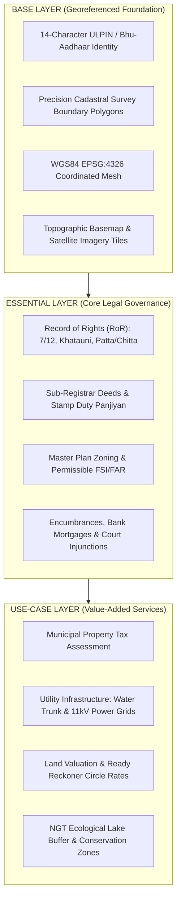
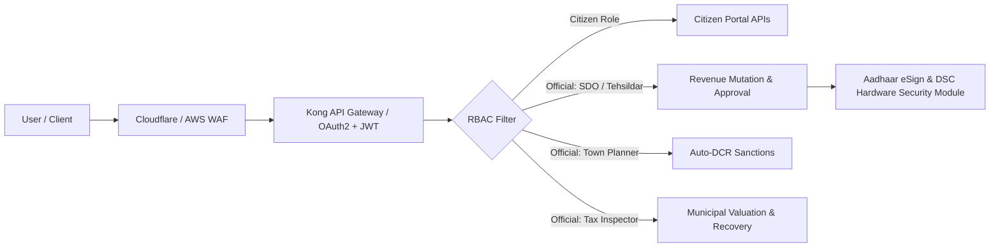
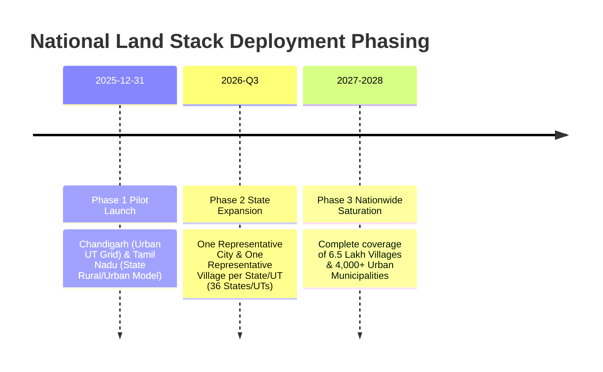

# GeoBharat (Land Stack) — Technical Architecture & Implementation Document
**National Digital Land Governance Platform for India**  
*Document Version: 1.0.0 | Spatial Reference: WGS84 (EPSG:4326) | Standard: Open Geospatial Consortium (OGC)*

---

## 1. Executive Summary & Problem Context

Land administration in India has historically operated within departmental and jurisdictional silos. Each state maintains distinct terminology, legacy measurement systems, disparate land record databases (e.g., Mahabhulekh in Maharashtra, Bhoomi in Karnataka, Dharani in Telangana, Bhulekh in UP, AnyROR in Gujarat), and separate Town Planning and Municipal Taxation registries.

**GeoBharat (Land Stack)** resolves these historical systemic challenges through:
1. **The 3-Layer GIS Architecture**: Strict separation of Base spatial topology, Essential legal governance, and Use-Case municipal services.
2. **14-Character ULPIN (Bhu-Aadhaar)**: Standardized spatial identifier derived from latitude/longitude bounding polygons.
3. **Universal Normalization Engine**: Real-time automated conversion of regional units (Bigha, Guntha, Cent, Gaj) into standard SI metric units (Sq. Meters and Acres).
4. **AI-Powered Health & Encroachment Auditing**: Automated legal risk scoring and satellite temporal change detection.
5. **Cross-Departmental Event Bus**: Automated synchronization between Sub-Registrar Offices (SRO), Revenue Departments, and Municipal Local Bodies (ULBs).

---

## 2. The 3-Layer GIS Architecture

GeoBharat structures all parcel-linked information into three decoupled, interoperable spatial layers:



### Layer Specifications

| Layer | Primary Custodian | Data Formats | Key Attributes |
| :--- | :--- | :--- | :--- |
| **Base Layer** | Survey of India / State Settlement Commissioners | GeoJSON, TopoJSON, WFS, PostGIS Vectors | `ulpin`, `geometry (Polygon)`, `survey_no`, `centroid_lat_lng`, `crs: EPSG:4326` |
| **Essential Layer** | Revenue Dept (Bhoomi/Mahabhulekh) & IGR SRO | JSON-LD, OpenAPI REST, XML (e-Sign) | `owner_name`, `khata_no`, `deed_number`, `zone_type`, `encumbrances`, `mutation_ledger` |
| **Use-Case Layer** | Urban Local Bodies (PMC/BBMP), MSEDCL, Water Boards | GeoJSON LineStrings/Points, REST APIs | `tax_due`, `assessed_value`, `water_dia_mm`, `power_kw`, `satellite_encroachment_flag` |

---

## 3. Common Data Schemas & State-Wise Normalization

### 3.1 Normalization of Disparate Regional Land Records

| Region / State | Regional Record Variant | Local Land Measure | Standard Metric Conversion |
| :--- | :--- | :--- | :--- |
| **Maharashtra / Gujarat** | **7/12 & 8A (Satbara)** | Hectare-Are-Guntha | `1 Guntha = 101.171 sq.m` • `1 Are = 100 sq.m` • `1 Ha = 10,000 sq.m` |
| **Uttar Pradesh / Haryana / MP** | **Khatauni & Khasra** | Pakka Bigha / Biswa | `1 Pakka Bigha = 2,529.3 sq.m` • `1 Biswa = 126.46 sq.m` |
| **Tamil Nadu / Kerala** | **Patta & Chitta** | Cents & Grounds | `1 Cent = 40.4686 sq.m` • `1 Ground = 222.96 sq.m` |
| **Karnataka / AP** | **RTC Pahani / Bhoomi** | Gunthas & Acres | `1 Guntha = 101.171 sq.m` • `1 Acre = 4,046.86 sq.m` |
| **Metros (Mumbai/Pune/BLR/HYD)** | **Urban Land Card / TSLR** | Gaj / Sq. Yards | `1 Gaj = 0.836127 sq.m` • `9 sq.ft` |

### 3.2 Canonical JSON Schema: Land Parcel (Unified Cadastral Object)

```json
{
  "$schema": "https://json-schema.org/draft/2020-12/schema",
  "title": "GeoBharatParcel",
  "type": "object",
  "required": ["ulpin", "geometry", "properties"],
  "properties": {
    "ulpin": {
      "type": "string",
      "pattern": "^[0-9]{14}$",
      "description": "14-digit standardized Bhu-Aadhaar identifier"
    },
    "geometry": {
      "type": "object",
      "properties": {
        "type": { "type": "string", "enum": ["Polygon", "MultiPolygon"] },
        "coordinates": { "type": "array" }
      }
    },
    "properties": {
      "type": "object",
      "required": ["survey_no", "village", "area_sqm", "owner_name", "record_type"],
      "properties": {
        "survey_no": { "type": "string" },
        "village": { "type": "string" },
        "taluka": { "type": "string" },
        "district": { "type": "string" },
        "state": { "type": "string" },
        "record_type": { "type": "string" },
        "native_unit": { "type": "string" },
        "area_sqm": { "type": "number", "minimum": 1 },
        "area_acres": { "type": "number", "minimum": 0 },
        "owner_name": { "type": "string" },
        "zone_type": { "type": "string" },
        "status": { "type": "string" },
        "health_score": { "type": "integer", "minimum": 0, "maximum": 100 },
        "utilities": {
          "type": "object",
          "properties": {
            "water_connection": { "type": "boolean" },
            "electricity_load_kw": { "type": "number" },
            "sewage_connected": { "type": "boolean" }
          }
        }
      }
    }
  }
}
```

---

## 4. API Specifications & Interoperability Standards

The platform implements an **OpenAPI 3.0** compliant architecture with RESTful endpoints and asynchronous webhook event streaming.

### 4.1 Key REST Endpoints

#### 1. Cadastral Spatial Base
- `GET /api/v1/parcels`
  - **Query Params**: `bbox` (minLng, minLat, maxLng, maxLat), `village`, `district`
  - **Response**: GeoJSON `FeatureCollection` with precision cadastral boundaries.
- `GET /api/v1/parcels/:ulpin`
  - **Response**: Single GeoJSON Feature containing all 3 spatial layers joined by ULPIN.

#### 2. Essential Legal Layer
- `GET /api/v1/parcels/:ulpin/ror`
  - **Response**: Record of Rights entity containing khata number, co-owners, share ratios, soil classification, and full historical mutation ledger (`mutation_history`).
- `GET /api/v1/parcels/:ulpin/registration`
  - **Response**: Registered deed particulars from Sub-Registrar database, consideration, stamp duty challans, active encumbrances, and Form 15 Non-Encumbrance Status.
- `GET /api/v1/parcels/:ulpin/planning`
  - **Response**: Master Plan zoning, base and premium FSI, road setbacks, and sanctioned building permits.

#### 3. Use-Case Municipal Layer
- `GET /api/v1/parcels/:ulpin/taxation`
  - **Response**: Property tax assessment ID, annual demand, due amounts, and historical payment ledger.
- `POST /api/v1/parcels/:ulpin/taxation/pay`
  - **Request Body**: `{ "amount": 68400, "payment_mode": "BBPS_UPI" }`
  - **Response**: Instant digital payment reconciliation and receipt generation.
- `GET /api/v1/utilities`
  - **Response**: Linear vector GeoJSON of water supply mains, 11kV electrical feeder cables, transformer substations, and NGT ecological conservation buffers.

#### 4. Cross-Departmental Interoperability Event Bus
- `POST /api/v1/workflows/sync-sale-deed`
  - **Trigger**: Executed upon registration of deed at Sub-Registrar Office.
  - **Payload**:
    ```json
    {
      "ulpin": "27250010045001",
      "new_owner": "Vikramaditya Rao",
      "deed_number": "PUN-HAV4-2024-9988",
      "consideration_inr": 24500000
    }
    ```
  - **Asynchronous Execution Flow**:
    1. SRO Deed Panjiyan stored and digitally signed.
    2. Event dispatched to Kafka / Redis Event Bus topic `land.deed.registered`.
    3. Revenue Microservice consumes event: updates RoR, generates automatic Ferfar mutation notice.
    4. Municipal ULB Microservice consumes event: updates property tax assessment ledger.
    5. DigiLocker & Push Notification service dispatches updated passbook to citizen.

---

## 5. AI/ML Subsystems

### 5.1 AI Land Health & Dispute Risk Index (0–100)
A machine learning scoring model evaluates parcel title cleanliness across 4 key dimensions:

$$\text{Land Health Score} = 0.35 \times T_{\text{Title}} + 0.25 \times E_{\text{Encumbrance}} + 0.20 \times Z_{\text{Zoning}} + 0.20 \times X_{\text{Tax}}$$

- **Title Cleanliness ($T_{\text{Title}}$)**: Penalized by active lis pendens, civil court stays, or contested mutations.
- **Encumbrance Cleanliness ($E_{\text{Encumbrance}}$)**: Evaluates registered bank liens, hypothecation amounts vs. circle rate valuation.
- **Zoning Conformity ($Z_{\text{Zoning}}$)**: Flags non-conforming land uses (e.g. residential development inside NGT lake buffer or green belt).
- **Tax Compliance ($X_{\text{Tax}}$)**: Evaluates outstanding municipal dues and penalty interest arrears.

### 5.2 Satellite AI Encroachment & Temporal Change Detection
- **Input Data**: Multispectral Sentinel-2 (10m) baseline paired with high-resolution PlanetScope / Cartosat (0.8m) current imagery.
- **Computer Vision Model**: U-Net with ResNet-50 backbone trained on building footprints and vegetation indices (NDVI).
- **Encroachment Logic**: Compares segmented built-up masks against the official WGS84 cadastral polygon boundary. Any structural pixel mask outside the polygon polygon or extending across neighboring ridges triggers an `unapproved_construction_flag: true` with measured deviation distance in meters.

---

## 6. Security Architecture & Role-Based Access Control (RBAC)



### RBAC Permission Matrix

| Capability / API | Anonymous / Guest | Citizen (Landholder) | Revenue Officer (Talathi/SDO) | Urban Planner (PMRDA/LDA) | Tax Inspector (ULB) |
| :--- | :---: | :---: | :---: | :---: | :---: |
| View Base Cadastral Map | Read-Only | Read-Only | Read-Only | Read-Only | Read-Only |
| View Record of Rights (RoR) | Summary | Full Access | Full Access | Full Access | Full Access |
| View Registration Deeds & EC | Summary | Full (Own Parcel) | Full Access | Full Access | Read-Only |
| Download Land Passport | Summary | Full Signed PDF | Full Signed PDF | Full Signed PDF | Full Signed PDF |
| Submit Service Petition | ❌ | Allowed | ❌ | ❌ | ❌ |
| Scrutiny & Approve Mutation | ❌ | ❌ | Allowed (DSC Sign) | ❌ | ❌ |
| Approve Building Permissions| ❌ | ❌ | ❌ | Allowed (Auto-DCR) | ❌ |
| Pay Municipal Taxes Online | ❌ | Allowed | ❌ | ❌ | Allowed |

---

## 7. Cloud-Native Deployment Strategy

### 7.1 Microservices Architecture
- **Frontend**: React 18, Vite, Tailwind CSS, Leaflet, Recharts, Zustand (Hosted via NGINX on CDN).
- **Backend API Gateway**: FastAPI / Django REST Framework with Gunicorn + Uvicorn workers.
- **Spatial Database**: PostgreSQL 16 with PostGIS 3.4 extensions, partitioned spatially by State/District codes.
- **Tile Server**: GeoServer / Tegola vector tile server connected to PostGIS for streaming MVT (Mapbox Vector Tiles) and WFS services.
- **Event Bus & Caching**: Apache Kafka / Redis Cluster for cross-departmental webhooks.

### 7.2 Production Docker & Kubernetes Manifests

```yaml
apiVersion: apps/v1
kind: Deployment
metadata:
  name: geobharat-frontend
  namespace: landstack
spec:
  replicas: 3
  selector:
    matchLabels:
      app: geobharat-frontend
  template:
    metadata:
      labels:
        app: geobharat-frontend
    spec:
      containers:
      - name: frontend
        image: geobharat/frontend:v1.0.0
        ports:
        - containerPort: 80
        resources:
          limits:
            cpu: "500m"
            memory: "512Mi"
          requests:
            cpu: "100m"
            memory: "128Mi"
        livenessProbe:
          httpGet:
            path: /
            port: 80
          initialDelaySeconds: 10
          periodSeconds: 15
```

---

## 8. UI/UX Design System, Color Schemas & Accessibility (GIGW)

The user interface follows the **Guidelines for Indian Government Websites (GIGW 3.0)** and **WCAG 2.1 Level AA** standards. It emphasizes high visual legibility, restrained governmental authority, and intuitive spatial interaction without visual clutter.

### 8.1 Official Color Palette

| Token Name | Hex Code | Purpose / Usage | WCAG Contrast Ratio |
| :--- | :--- | :--- | :--- |
| **Gov Navy (Primary)** | `#0B2545` | Main navigation header, brand emblems, primary action CTAs | `14.8:1` (Passes AAA) |
| **Ashoka Blue (Surface)** | `#134074` | Sub-headers, focused boundaries, active states | `8.9:1` (Passes AAA) |
| **Saffron / Gold (Accent)** | `#FF9933` / `#D97706` | Cadastral selection highlights, Land Health badge accents | `5.2:1` (Passes AA) |
| **India Green (Success)** | `#10B981` / `#059669` | Clear titles, tax-paid parcels, verified status tags | `4.8:1` (Passes AA) |
| **Signal Crimson (Alert)** | `#EF4444` / `#DC2626` | Court injunctions, tax dues, satellite encroachment masks | `4.7:1` (Passes AA) |
| **Cadastral Neutral 50** | `#F8FAFC` | Main application backdrop, map canvas background | Baseline |
| **Cadastral Neutral 800**| `#1E293B` | Primary body typography and survey plot numbers | `12.6:1` (Passes AAA) |

### 8.2 Spatial Viewport Geometry
- **Dual-Pane Viewport**: In spatial exploration mode, the georeferenced Leaflet map occupies **60–65%** of the viewport width. Upon selecting a parcel, the **Land Detail Drawer** slides in from the right (**35–40%** width) without occluding the target polygon.
- **Mobile First Accessibility**: On mobile viewports (<768px), the drawer transitions into an elevated bottom sheet with swipe-to-dismiss gesture support.
- **Typography**: Primary typeface is **Inter** (humanist sans-serif for legibility in numerical records) paired with **JetBrains Mono** for 14-digit ULPIN identifiers, coordinates, and survey plot numbers.

---

## 9. National Rollout Roadmap & Scalability Strategy (DoLR Pilot Alignment)

In alignment with the Department of Land Resources (DoLR) mandate, Land Stack is engineered for phased, horizontal scale:



### 9.1 Phase-Wise Implementation Strategy
1. **Phase 1: Pilot Verification (Launched 31 December 2025)**:
   - **Chandigarh (Urban UT)**: Validating high-density commercial property cards, heritage facade regulations, and automated municipal building plan sanctions.
   - **Tamil Nadu (Rural-Urban Continuum)**: Validating rural Patta/Chitta extraction, Field Measurement Book (FMB) digitization, and integration with Chennai CMDA urban planning schemes.
2. **Phase 2: 1-City + 1-Village Deployment**:
   - Deployment of the Land Stack dynamic schema adapter across all 28 States and 8 Union Territories.
   - Each state connects one statutory urban local body (e.g. Pune PMC in Maharashtra, Lucknow LDA in UP, BBMP in Karnataka) and one rural revenue village to demonstrate cross-registry normalization.
3. **Phase 3: Nationwide Saturation**:
   - Federated national architecture with State Data Centre (SDC) nodes connected to the National Bhu-Aadhaar Gateway via high-speed BharatNet optical networks.

---

## 10. Summary Checklist of Capabilities Delivered

- [x] **3-Layer GIS Architecture**: Base (Cadastral Boundaries & ULPIN), Essential (RoR, Registration & Zoning), Use-Case (Utilities Network, Property Tax & Eco-Buffers).
- [x] **Official DoLR Pilot Grounding**: Dedicated support and interactive filtering for **Chandigarh (Urban UT Pilot)** and **Tamil Nadu (State Rural/Urban Pilot)**.
- [x] **Rural vs Urban Dual Cadastre**: Distinct workflows for agricultural crop ledgers/FMB versus municipal master planning/FSI.
- [x] **Universal Measurement Normalization**: Bigha, Guntha, Cent, Ground, Gaj converted in real-time to Sq. Meters & Acres.
- [x] **AI Land Health Score & Dispute Risk Index**: Algorithmic 0–100 risk rating with multi-pillar evaluation.
- [x] **Satellite AI Change Detection**: Interactive before/after slider detecting unapproved construction and boundary shifts.
- [x] **Predictive Fiscal Analytics & Decision Support**: Machine learning 3-year revenue realization and seasonal mutation surge forecasting.
- [x] **Single-Window "Land Passport"**: Multi-tier digital certificate with QR code verification and print layout.
- [x] **Cross-Departmental Synchronization**: SRO sale deed triggering automated RoR mutation and municipal tax revision.
- [x] **Standard Technical Document**: Full API, schema, security, UI/UX color palettes, and cloud architecture specifications.

